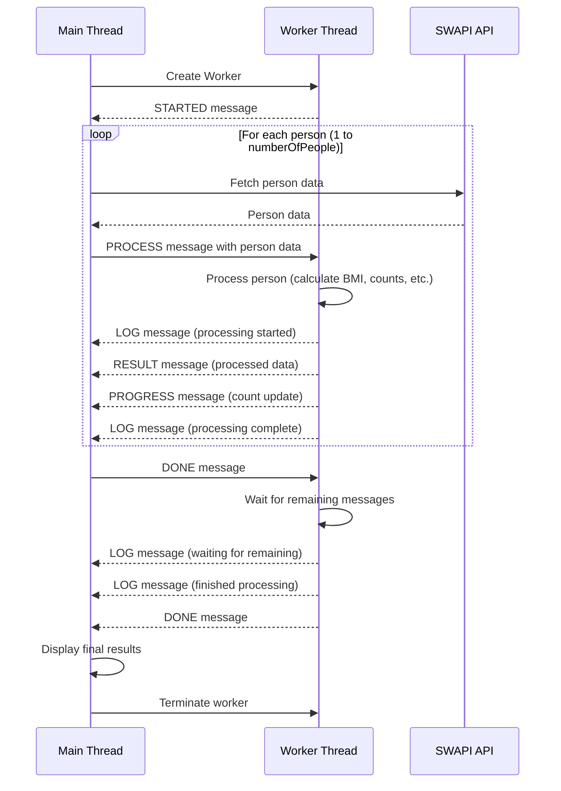

# worker-threads

A repository to test the use of worker threads. Because Node _is only single threaded by default_.

<p align="center">
  
</p>

# Table Of Contents

- [Overview](#overview)
- [Getting Started](#getting-started)
- [How It Works](#how-it-works)

# Overview

This project shows how to do multi-threading in Node, which is achieved with [`worker_threads`](https://nodejs.org/api/worker_threads.html). A worker thread is a completely seperate thread on which you can perform operations and leave the main thread's **[Event Loop](https://nodejs.org/en/learn/asynchronous-work/event-loop-timers-and-nexttick)** free to handle I/O events as they are raised by the underlying OS.

> [!WARNING]
> This little project does not deal with _mutli-tenancy_. Which is to say, if you are trying to use a worker thread in a server application that services simultaneous request, you will have to either spawn a new thread per request (in Linux this calls `pthread_create` so it is a real POSIX thread), make sure you identify a request id on each message (or something to that effect), or use a pooling library, etc.
x
[Table of Contents](#table-of-contents)

## Getting Started

To start you can simply run:

```sh
yarn && yarn dev
```

This will both build and run the application with defaults.

_However_, you can tune the testing to adjust the number of IO requests (in this case,
we're requesting Star Wars characters via the [Star Wars API](https://swapi.dev/) aka `SWAPI`).

```sh
cp .env.example .env
```

There are two values you can set:

- `NUMBER_OF_PEOPLE`: the number of people to request.
- `PROCESSING_DELAY_IN_MS`: the amount of delay to simulate on the processing side.

To add further variablility (or realism), each `SWAPI` call will introduce some random amount of delay to simulate making IO calls on a system under load. **Note: in practice, `SWAPI` is really fast so it doesn't give us a good idea of a system that might be caught doing downstream processing.**

[Table of Contents](#table-of-contents)

## How It Works

In the file `src/index.ts` we create a [`Worker`](https://nodejs.org/api/worker_threads.html#worker-threads). This worker communicates via event processing. The worker is defined in `src/workers/worker-one.ts`. Bi-directional communication is done via messages. Messages from the parent/orchestrator are sent via the `worker`. Messages from the `worker` instance are sent via the [`parentPort`](https://nodejs.org/api/worker_threads.html#workerparentport).



[Table of Contents](#table-of-contents)
